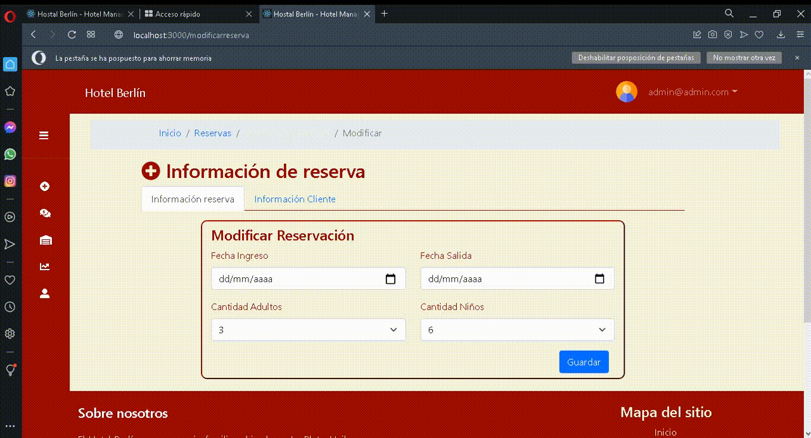

# HOTELMANAGER

This repository contain all the information associated with the development of an Integral Management System to support inventory, rooms reservation, accounting and services requests tasks of the small business Hotel Berlin.

## Take a look at the system 👀

| Pay module                           | Reservation module                       |
| ------------------------------------ | ---------------------------------------- |
|  |  |

| Inventory module                           | Products and services module                    |
| ------------------------------------------ | ----------------------------------------------- |
|  |  |

## Development Team

- [Eduardo Daza](https://github.com/Eduardo2020-code)
- [Juan Diego Garcia](https://github.com/juanxgar)
- [Miguel Rincon](https://github.com/Rincon3)
- [Aida Mina](https://github.com/iamaida)

## Tech stack

- Reactjs
- Nodejs
- PosgreSql
